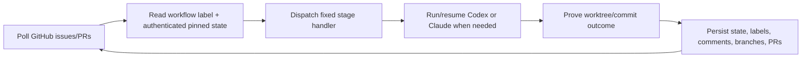
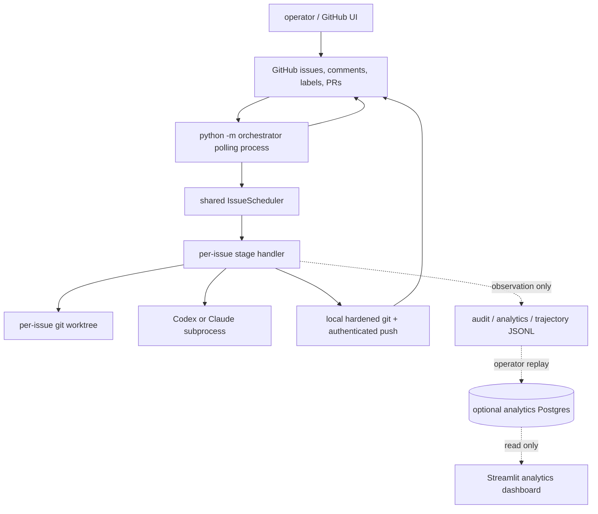
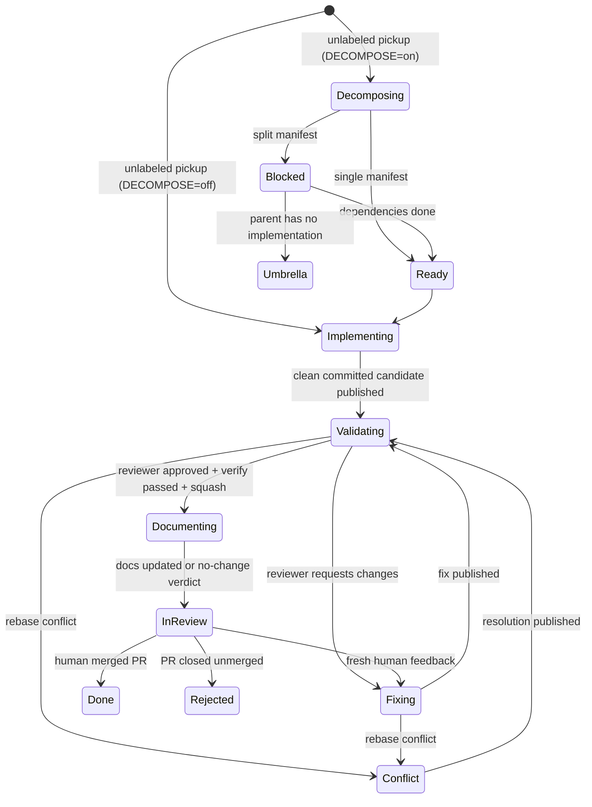

# Chipping Orchestrator architecture

Chipping Orchestrator is a single-process Python polling service that turns GitHub issues into work for local Codex or
Claude CLI subprocesses. GitHub is both the task tracker and durable workflow store: one workflow label exposes an
issue's current stage, and one authenticated pinned JSON comment carries the state needed by the next tick. Work is
performed in per-issue git worktrees and published by the orchestrator through hardened git operations.

This comparison-oriented overview condenses [`../docs/architecture.md`](../docs/architecture.md),
[`../docs/state-machine.md`](../docs/state-machine.md), [`../docs/workflow.md`](../docs/workflow.md), and
[`../docs/security.md`](../docs/security.md).

## Mental model



The local process can restart between ticks because the dispatch input is remote and durable. Worktrees preserve
unpublished local commits and unsafe/dirty states for inspection, but the process itself owns no workflow database.

## Core principles

### GitHub-backed durable state

Workflow correctness depends on:

- the issue's `WorkflowLabel` value;
- the state-only `<!--orchestrator-state {...json...}-->` comment authored by the orchestrator account;
- remote branches, PRs, reviews/checks/comments, and custom snapshot refs where a late split uses them.

Audit/analytics/trajectory files and the optional Postgres database are observation-only and are never read by the
polling tick.

### Fixed label-driven routing

The delivery flow is explicit rather than planner-selected. Labels route to pickup, decomposition/family handling,
implementation, validation, final documentation, human review, fixing, conflict resolution, question, or discussion
handlers. `done` and `rejected` are terminal no-ops. Human-applied `backlog` and `paused` controls can defer work.

### Host is the agent sandbox

Codex and Claude run with sandbox/approval bypass flags. Prompt wording is not an isolation boundary. The host,
container, or VM and its OS account are the real sandbox; GitHub credentials and production-secret-shaped environment
values are filtered from agent/verify subprocesses, but provider auth is deliberately retained for agent calls.

### Orchestrator-owned publication

Agents commit locally but do not receive the orchestrator's GitHub token. The orchestrator validates the worktree and
candidate, then pushes an explicit refspec through an askpass credential and hardened Git configuration. Humans merge
PRs; the orchestrator never merges from `in_review`.

## System topology



There is no loopback HTTP daemon, Electron supervisor, mobile client, terminal WebSocket, or local product API in the
documented architecture. The operator interacts through GitHub and process/log/dashboard tools.

## Process model

`python -m orchestrator` (or the `chipping-orchestrator` console script) is the only long-lived application process.
`run.sh` wraps it for production self-update/restart. `--once` executes one polling pass and exits.

Each loop:

1. checks whether the orchestrator's own base branch advanced with changes under `orchestrator/`;
2. runs one `workflow.tick` per configured repository (parallel across repos when more than one);
3. reaps scheduler completions;
4. prunes the analytics sink when configured;
5. waits `POLL_INTERVAL` (default 60 seconds).

SIGINT/SIGTERM closes scheduler submission, terminates in-flight agent/verify process groups, and drains within
`SHUTDOWN_GRACE_SECONDS`, with a watchdog hard-exit backstop. A coding agent is a transient child subprocess, not a
daemon.

## Per-tick scheduling

One long-lived `IssueScheduler` enforces global and per-repository concurrency. Family-aware work—unlabeled pickup,
`workflow:decomposing`, `workflow:blocked`, and `workflow:umbrella`—is serialized in one bucket per repository because
parents and children share state. Other stages fan out per issue. Pure blocked/umbrella walks and terminal cleanup can
be cap-exempt so they do not deadlock behind agent work.

Only `(repo slug, issue number)` crosses a worker-thread boundary. The worker creates its own GitHub client and
refetches the issue, avoiding reuse of thread-bound provider objects.

## Delivery flow

The ordinary single-task path is:



Oversized candidates can detour from any publication seam back to `workflow:decomposing` under a durable late
generation. A `single` verdict grants an exact-commit exemption; a `split` snapshots the commit, creates children,
supersedes the current PR where applicable, and turns the parent into an umbrella; a structured `question` parks for a
human.

## Agent subprocess

Three configurable roles select either backend:

- decomposer (`DECOMPOSE_AGENT`, default `claude`);
- implementer (`DEV_AGENT`, default `claude`);
- reviewer (`REVIEW_AGENT`, default `codex`).

The command-spec parser accepts a backend selector followed by quoted provider CLI arguments. Codex runs through
`codex exec ... --dangerously-bypass-approvals-and-sandbox --json`; Claude runs through `claude -p
--dangerously-skip-permissions --output-format stream-json ...`. Both return a normalized result with session id,
last message, exit/timed-out/interrupted facts, stdout/stderr, and parsed usage where available.

The dev and each decomposer-backed conversation pin their full backend+args spec and session identity independently;
reviewers are fresh each round.

## Worktree model

Each issue uses:

```text
worktree: WORKTREES_DIR/<owner>__<repo>/issue-<number>
branch:   orchestrator/<owner>__<repo>/issue-<number>
base:     <remote_name>/<base_branch>
```

The per-tick base refresh fetches once per repository and rebases eligible clean worktrees. PR branches are
force-pushed only with a lease pinned to the previously observed remote head. Question/discussion worktrees and
worktrees frozen by recovery/late-generation evidence skip automatic base sync.

## Hardened local git and push

Local git operations detach global/system config and disable hooks, credential helpers, fsmonitor, signing, replace
objects, and grafts. Status and reset name the worktree explicitly and inspect index flags that could hide modified
files. Added-line measurement pins attributes/diff behavior and refuses unpinnable repository configuration.

Push uses a temporary `GIT_ASKPASS`, rejects agent-writable URL/proxy/TLS rewrites, and names the exact commit whenever
a prior check selected one. Publications onto an existing PR are lease-pinned to the frozen remote head. A failed
proof parks the issue with the commit/worktree intact rather than guessing.

## Interfaces

The primary operator/control interface is GitHub:

- issue labels route stages;
- comments provide trusted human input and visible receipts/parks;
- a pinned state comment stores workflow data;
- branches/PRs carry published work;
- reviews/checks/comments drive the fix loop;
- manual merge/close supplies terminal outcomes.

The local console starts the polling process. Streamlit apps are read-only observability tools. There is no documented
REST or generated OpenAPI contract.

## Observability

Three independent JSONL sinks are documented:

- optional audit events (`EVENT_LOG_PATH`);
- analytics records (`ANALYTICS_LOG_PATH`, default under `LOG_DIR`);
- optional reasoning trajectories (`TRAJECTORY_LOG_PATH`, default off).

The analytics file can be replayed idempotently into an operator-owned Postgres database and read by a Streamlit
dashboard. A separate Streamlit trajectory viewer reads its JSONL directly. All fail open with respect to workflow.

## Load-bearing rules

1. Workflow labels and pinned-state keys are compatibility contracts; renames require migration.
2. The pinned comment is trusted only when authored by the orchestrator account and state-only in shape.
3. Agents never receive the orchestrator GitHub token; pushes are orchestrator-owned and hardened.
4. A failed/unreadable git or GitHub observation is not a safe default. Publication and cleanup fail closed.
5. Family-aware handlers do not run concurrently within one repository.
6. The orchestrator never auto-merges from `in_review`.
7. Observability sinks never steer dispatch and may be deleted without losing workflow state.
8. `analytics-db/data/` is operator runtime state and must not be traversed or modified by coding agents.
9. `plans/` is human working material, not a specification.

## Summary

The architecture favors visible, remotely durable workflow state and a small local runtime: poll GitHub, route a
fixed state machine, invoke transient agents in isolated worktrees, prove their output, publish through a hardened
credential boundary, and leave human decisions visible on the issue/PR thread.

