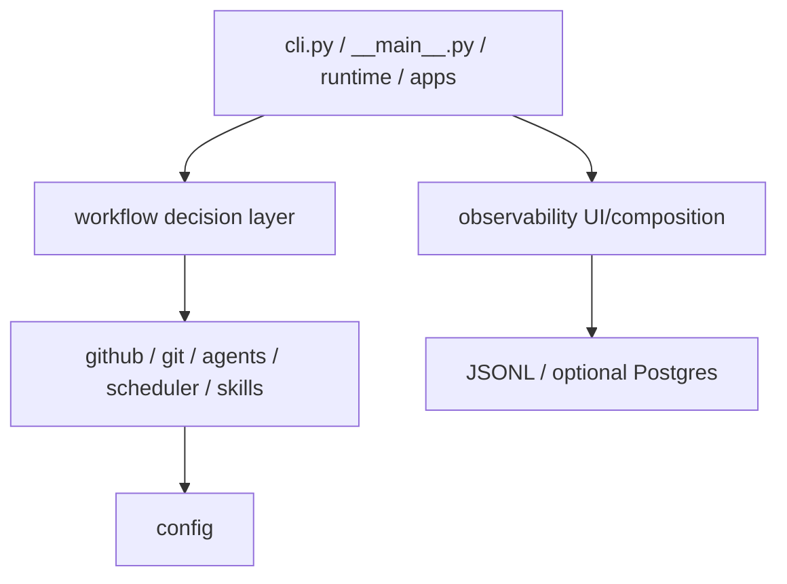

# Python code structure

This page maps Chipping Orchestrator's package ownership into the comparison slot used for backend code structure. The
authoritative inventories are [`../docs/architecture/platform-modules.md`](../docs/architecture/platform-modules.md),
[`../docs/architecture/workflow-modules.md`](../docs/architecture/workflow-modules.md), and
[`../docs/architecture/observability-modules.md`](../docs/architecture/observability-modules.md).

## Overview

The Python package uses four dependency bands:



Imports point downward. Repository tests inspect the tree and enforce layer direction, package inventories, explicit
surfaces, owner placement, naming, and mirrored tests.

## Top-level ownership

```text
orchestrator/
  __init__.py       package version only
  cli.py            console-script composition point
  __main__.py       python -m launch form
  runtime/          process state, logging, startup, ticks, loop, self-update, shutdown
  config/           .env parsing, validation, credential resolution/redaction, RepoSpec models
  github/           PyGithub client and issues/labels/comments/PR/review/check/state/event owners
  agents/           backend dispatch, command construction, result/session parsing, process groups, env filter
  scheduler/        global/per-repo caps, duplicate claims, family mutex, shutdown/reap
  git/              hardened commands, auth/push, worktrees, base sync, verification, measurement, snapshots
  workflow/         state vocabulary, tick engine, late-split domain, stage handlers
  skills/           repo catalog and local skill discovery
  observability/    analytics, usage, trajectories, dashboards/read models
  apps/             two Streamlit entry points
```

## `config`

Bottom layer. It loads non-secret `.env` values, resolves/validates settings, builds per-repository specs, resolves
GitHub tokens from the process environment or external token files, and redacts secrets. `GITHUB_TOKEN` and aliases
found in `.env` are warned about and ignored.

The package initializer is intentionally a settings surface. Most other package initializers either publish a narrow
explicit `__all__` or import nothing.

## `github`

Provider boundary over PyGithub. It owns issue polling/writes, label vocabulary/bootstrap/migration, raw and trusted
comment reads, pinned-state parsing/writing, PR/review/check operations, and audit event emission. The composed
`GitHubClient` is the public object; worker threads clone it rather than sharing request-bound objects.

Durable-state authentication belongs here: author identity and state-only comment shape are verified before JSON is
accepted.

## `agents`

Owns the common `AgentResult`/run options, Codex and Claude command builders/runners, session/final-message parsing,
credential filtering, process-group registration, timeout/shutdown termination, and backend dispatch. Workflow
handlers call the tracked wrapper; provider modules do not decide label transitions or publication.

## `scheduler`

Owns `IssueScheduler` and `SubmissionRequest`. It enforces global/per-repo caps, duplicate-active keys, family mutex,
cap-exempt cheap work, completion reporting, and bounded shutdown. The workflow decides what a refused submission
means for the tick.

## `git`

Owns filesystem and repository effects below workflow decisions:

- hardened command execution and locks;
- credential/askpass sessions and remote reads/pushes;
- per-issue worktree create/reuse/cleanup/inventory;
- pre-tick base refresh and PR-aware rebase recovery;
- local verify subprocesses and clean/head proofs;
- added-line measurement over pinned commits;
- immutable late-split snapshot refs;
- squash/publication planning and rewrite.

The workflow decides when to publish, split, park, or retry. Git owners answer what the repository safely permits.

## `workflow`

Owns the compatibility vocabulary (`WorkflowLabel`, `ControlLabel`, transition guard), one-repo tick, dispatch and
common guards/comments/terminals/drift/usage helpers, late-generation domain, and stage packages:

```text
stages/
  decomposition/   decomposing, ready, blocked, umbrella, late coordinator/transaction
  implementing/    spawn/resume/disposition/publication
  documenting/     final docs pass
  validating/      fresh review, local verify, approval/fix route
  in_review/       human feedback/readiness/terminal observation
  fixing/          debounced feedback and developer replay
  conflicts/       rebase conflict handling
  question/        read-only Q&A
  discussion/      design rounds and plan-PR publication
```

Stage-private helpers stay with their owner. Cross-stage calls name the owning module directly rather than a broad
facade. `orchestrator.workflow` publishes only the label/control vocabulary, transition guard/predicate/error, and
`tick`.

## `runtime`

Owns the polling process rather than workflow decisions: client/scheduler construction, per-repo tick fan-out,
one-shot/loop control, logging, self-update probe, signal handling, process-group termination, and bounded drain.

## `skills`

Owns observation-only skill catalog/discovery. The per-tick repository catalog becomes an analytics fact; it is not a
stage policy or dispatch input.

## `observability` and `apps`

The observability tree owns JSONL record construction/append/prune, usage/skill/trajectory parsing, analytics replay
and queries, and two UI read models. Optional psycopg/Streamlit/Plotly imports stay behind calls so the default runtime
does not require the dashboard dependency group. `apps` contains only the `streamlit run` composition targets.

## Dependency rules

- config points nowhere upward;
- domain packages sit below workflow;
- runtime/CLI/apps compose rather than being imported by lower layers;
- declared call-time exceptions from git base-sync into workflow are narrow and test-enforced;
- no relative imports, `.pyi` facades, dynamic module resolver hooks, or duplicate owner sites;
- operator log channel names are literal contracts;
- tests mirror runtime package layout and patch the owner named by the call site.

## Adding code

1. Put the responsibility on the existing owner if one exists.
2. Add a module only when the responsibility has no owner; keep package inventory/docs/tests in sync.
3. Follow dependency direction and import the concrete owner, not a facade.
4. Add/adjust tests in the mirrored package and patch that owner.
5. Update architecture/state/workflow docs when a public responsibility or compatibility contract moves.
6. Run focused tests, then the complete lint/build/test gate in [`development.md`](development.md).

